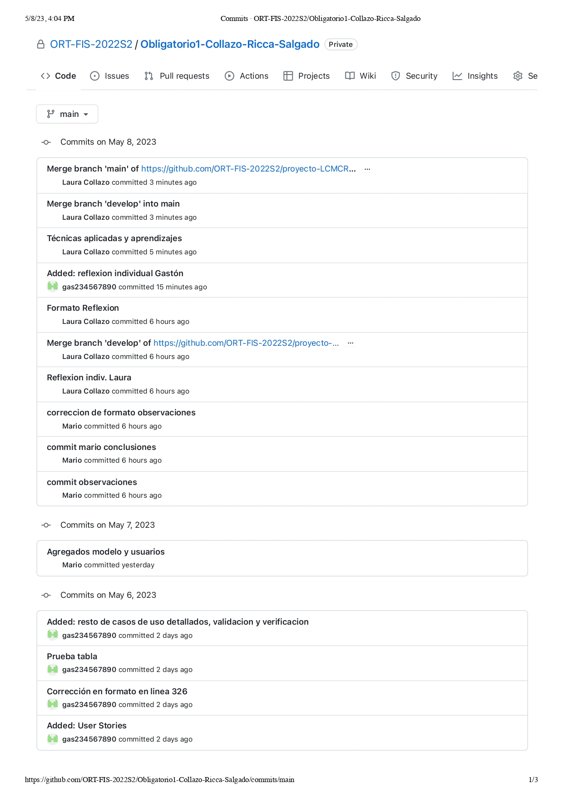
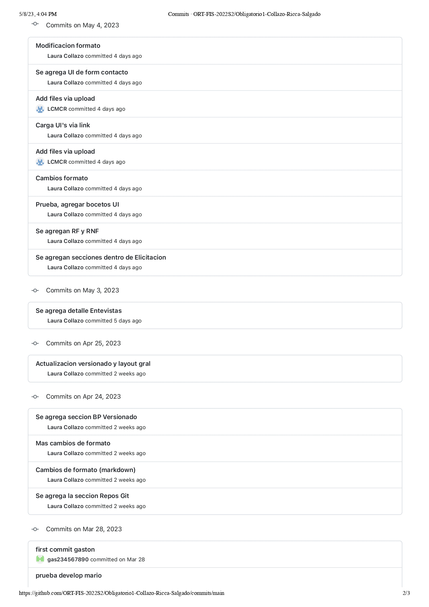
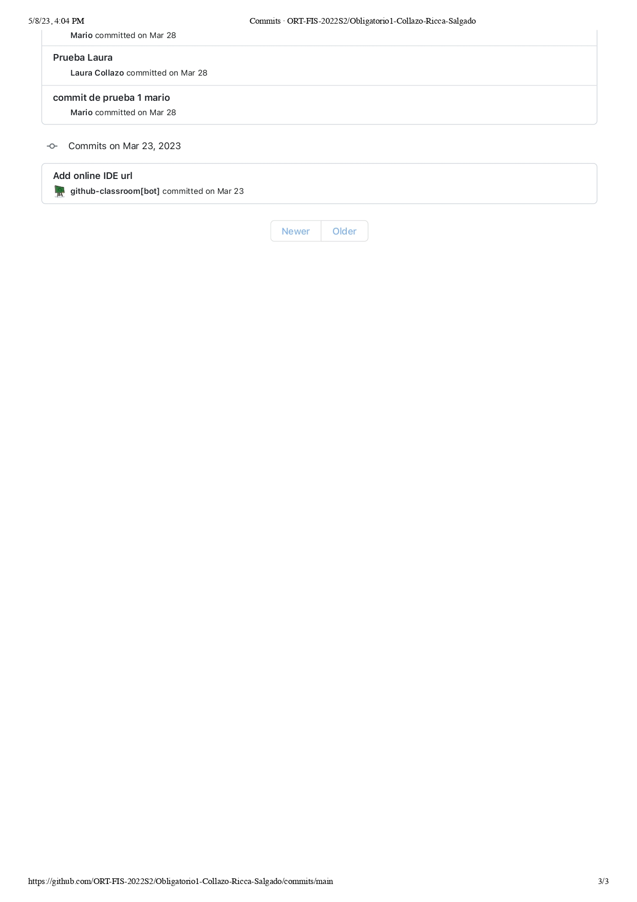
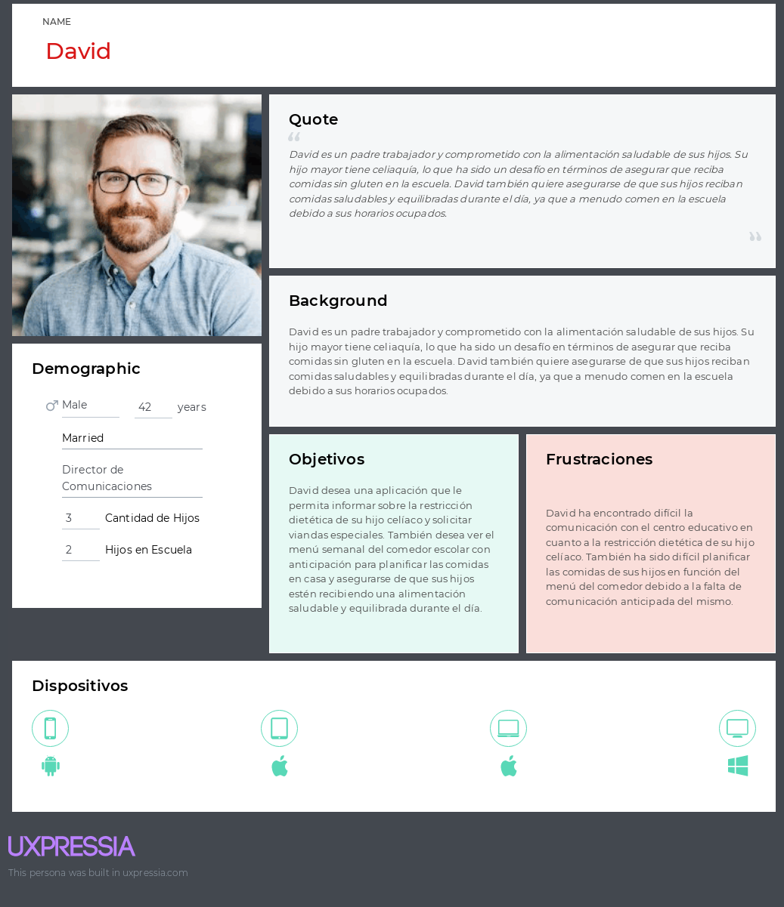
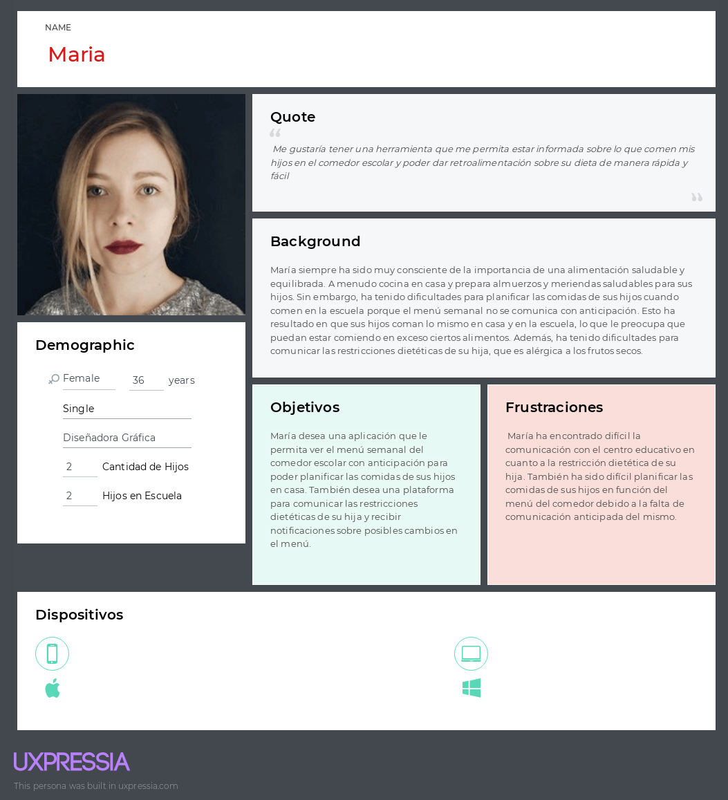
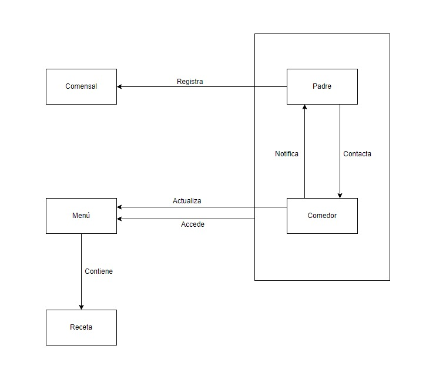
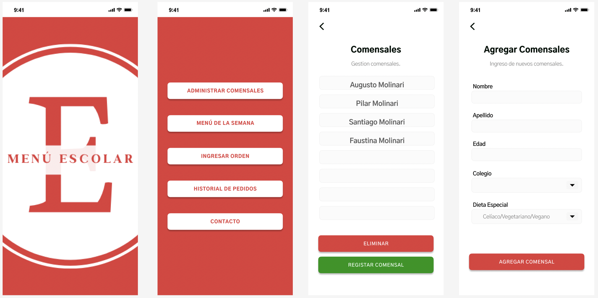
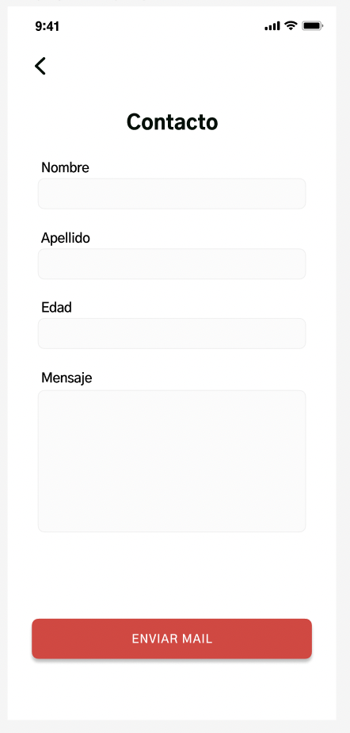
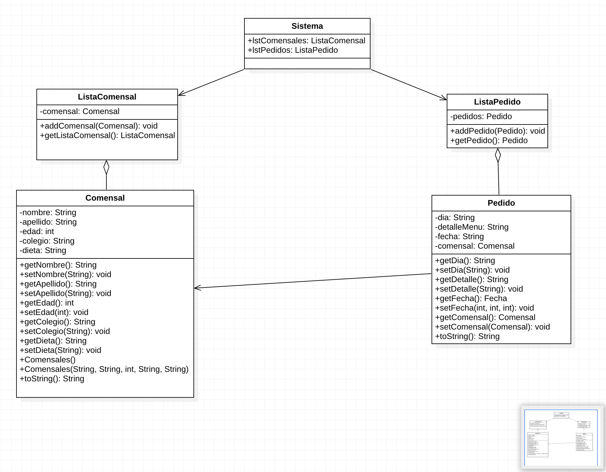
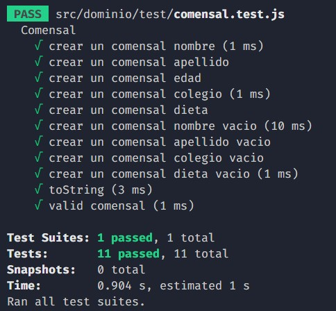

# FUNDAMENTOS DE INGENIERIA DE SOFTWARE - OBLIGATORIO 1

**Estudiantes:**
* Laura Collazo - 252803
* Mario Ricca - 212393
* Gaston Salgado - 212387

## REPOSITORIOS GIT

### Creación de repositorios locales y remotos

Se creo un repositorio en GitHub y luego cada integrante del equipo lo clono, utilizando el comando `git clone` y la url. Asi cada uno trabajar sobre el repositorio local, y luego se suben los cambios al repositorio remoto con el comando `git push`. Siempre antes de comentzar a trabajar en el repositorio local, se debe hacer un `git pull` para traer los cambios que se hayan hecho en el repositorio remoto.

### Comandos Git ejecutados desde el terminal y desde el IDE

* **git clone [URL del repo de GitHub]**

&nbsp;
  Inicializa un directorio existente como un repositorio Git local.

* **git status**

&nbsp;
  Muestra el estado del árbol de trabajo.

* **git add [nombre del archivo] o git add .**

&nbsp;
  Agrega el/los archivo/s al área de staging para el siguiente commit.

* **git commit -m "mensaje"**

&nbsp;
  Registra los cambios que se encuentran en el área de stagging.

* **git pull**

&nbsp;
  Incorpora los cambios remotos al repositorio local.

* **git push**

&nbsp;
  Envia los cambios locales al repositorio remoto.

* **git branch**

&nbsp;
  Lista las ramas existentes en el repositorio.  

* **git branch [nombre de la rama]**

&nbsp;
  Crea una nueva rama con el nombre indicado.

* **git checkout [nombre de la rama]**

&nbsp;
  Cambia de rama, a la indicada, y actualiza el directorio de trabajo.

* **git merge [nombre de la rama]**

&nbsp;
  Mergea la rama indicada con la rama actual.

* **git log**

&nbsp;
  Muestra el historial de commits.

* **git fetch**

&nbsp;
  Descarga todas las ramas del repositorio remoto al repositorio local.

## VERSIONADO

### Aplicar buenas prácticas de versionado

Aplicar buenas prácticas de versionado en el desarrollo de software implica mantener un control sistemático y ordenado de los cambios realizados en el código fuente y en otros elementos del proyecto a lo largo del tiempo. Algunas implicaciones de esto son:

1. Control de cambios: Las buenas prácticas de versionado permiten realizar un seguimiento de los cambios que se realizan en el código fuente y otros elementos del proyecto. Esto ayuda a los desarrolladores a comprender los cambios realizados en el pasado y a mantener una visión general del estado actual del proyecto.

2. Colaboración: Las herramientas de control de versiones, como Git, permiten que múltiples desarrolladores trabajen en el mismo proyecto simultáneamente. El uso de buenas prácticas de versionado ayuda a evitar conflictos y a mantener la colaboración fluida y organizada.

3. Reversión: Las buenas prácticas de versionado permiten a los desarrolladores revertir los cambios realizados en el código fuente y otros elementos del proyecto en caso de que se produzca un error o un problema inesperado. Esto permite una recuperación rápida y eficiente del proyecto en caso de que algo salga mal.

4. Auditoría: Las buenas prácticas de versionado proporcionan un historial completo de los cambios realizados en el proyecto, lo que permite a los desarrolladores y otros interesados en el proyecto realizar una auditoría del código fuente y otros elementos. Esto ayuda a garantizar la calidad del código y a detectar cualquier problema potencial.

En resumen, aplicar buenas prácticas de versionado en el desarrollo de software ayuda a mantener un control ordenado y sistemático de los cambios realizados en el proyecto, fomenta la colaboración y permite la recuperación rápida y eficiente del proyecto en caso de problemas.

### Uso de ramas separadas de 'main'

Utilizamos dos ramas principales, develop y main. La rama main se utiliza unicamente para pasar a producción, y la rama develop se utiliza para el desarrollo del proyecto. Cada vez que se finaliza una funcionalidad, que el equipo aprueba, se hace un merge de la rama develop a la rama main, y se sube a producción.

### Resumen de commits y evolución del proyecto 

## ELICITACION

### Evidencias de actividades de investigación
#### Entrevistas 
Se realizaron dos entrevistas:

&nbsp;
Entrevista 1: se realizo a una madre de tres niños, de los cuales solo uno sigue siendo estudiante de primaria.

&nbsp;
Entrevista 2: padre de dos niños, ambos niños practican el judaísmo y uno tiene celiaquía.

&nbsp;
Ambos padres envían a sus hijos a escuelas públicas de turno completo donde reciben un almuerzo.

&nbsp;
La primera conclusión a la que se llego es que el sistema de comedores en escuelas públicas funciona bien en su objetivo de alimentar a los niños. De la primera entrevista se vio que en la escuela pública muchas veces el menú semanal no es comunicado con antelación lo cual genera cierta dificultad al preparar las compras en la casa para evitar que sus hijos comieran en sus casas de noche lo mismo que en la escuela.

&nbsp;
Por otro lado, se aprendio que la Dirección General de Educación Inicial y Primeria (DGEIP) no puede, por un tema de escala y costos, garantizar opciones para todas las restricciones dietarías, en particular condiciones de carácter filosófico sean religiosas o éticas. En estos casos se le brinda al niño alimentos adecuados dentro de lo posible y se les pide a los padres en esos casos que complementen la alimentación ya sea llevando sus propias viandas a la escuela para cubrir total o parcialmente el almuerzo dependiendo del caso.

&nbsp;
Ambos padres encontraron difícil la comunicación con los centros escolares, ya que, a pesar de elaborarse la comida en los centros educativos, la planificación es llevada a cabo para todas las escuelas por un equipo de nutricionistas contratado por la DGEIP

#### Observaciones
Al estudiar el funcionamiento de un comedor escolar llegamos a las siguientes conclusiones

&nbsp;
• La escuela tiene un sistema de comedor bastante organizado y limpio, con personal encargado de la preparación y distribución de los alimentos.

&nbsp;
• Los niños están sentados en mesas largas, compartiendo el espacio con otros estudiantes de diferentes edades, fomentando la socialización y el compañerismo durante la
comida.

&nbsp;
• Sin embargo, se observa que hay poca variedad de alimentos en el menú, lo que podría resultar monótono y poco atractivo para los niños a largo plazo.

&nbsp;
• Además, se nota la falta de opciones para niños con restricciones dietarias, ya sea por motivos religiosos, éticos o médicos.

&nbsp;
• No se comunica con suficiente antelación el menú semanal a los padres, lo que dificulta la planificación de las compras de alimentos en casa para aquellos padres que desean complementar la dieta de sus hijos en casa.

&nbsp;
• Aunque las recetas son sencillas los encargados del comedor no tienen acceso a la receta con antelación, lo que podria llegar a dificultad la preparación correcta de los platos.

&nbsp;
• También se observa que no hay una forma clara para que los padres se comuniquen con el equipo del comedor para informar sobre restricciones dietarias o dar retroalimentación sobre la dieta de sus hijos.

&nbsp;
&nbsp;

#### Lluvia de ideas 
A raíz de las entrevistas y luego de discutir el alcance de la aplicación decidimos hacer una lluvia de ideas para ver que funcionalidades debería tener la app.
* Visualización del menú semanal con anticipación para los padres y los estudiantes.
* Plataforma de intercambio entre los padres y los encargados del comedor para dar retroalimentación sobre los alimentos y comunicar restricciones dietarías.
* Funcionalidad para que los padres puedan enviar sus comentarios y sugerencias sobre el menú de la semana y los alimentos servidos en el comedor.
* Notificaciones sobre posibles cambios en el menú semanal o cancelaciones del servicio de comedor.
* Sistema de registro para informar sobre restricciones dietarías de los estudiantes.
* Información nutricional sobre los alimentos servidos en el comedor.
* Posibilidad de solicitar viandas especiales para estudiantes con restricciones dietarías.
* Espacio para que los estudiantes puedan compartir sus opiniones sobre los alimentos servidos en el comedor y dar retroalimentación.

### Referencias a fuentes de información

### Caracteriazción de usuarios: User Personas
 

### Modelo conceptual del problema

## ESPECIFICACION

### Definición de requerimientos funcionales y no funcionales

#### Actores
* Padre/Madre
* Encargado del comedor

#### Requerimientos Funcionales

*  **RF1: Registro de comensales**

&nbsp;
**Actores:** Padre

&nbsp;
**Descripción:** El sistema debe permitir a los padres registrar los comensales (hijos) que quiere gestionar con la aplicación.

&nbsp;
**Prioridad:** Alta

* **RF2: Administrar comensales**

&nbsp;
**Actores:** Padre

&nbsp;
**Descripción:** El sistema debe permitir a los padres ademas de registrar los comensales, eliminar los que ya no quiera gestionar con la aplicación.

&nbsp;
**Prioridad:** Alta

* **RF3: Ver el Menú Semanal**

&nbsp;
**Actores:** Padre, Encargado del Comedor

&nbsp;
**Descripción:** El sistema debe permitir a los padres y encargado del comedor ver los platos del menú para toda la semana con el detalle de que incluye cada uno.

&nbsp;
**Prioridad:** Alta

* **RF4: Ingresar una orden por comensal**

&nbsp;
**Actores:** Padre

&nbsp;
**Descripción:** El sistema debe permitir a los padres cargar una orden en la cual pueden elegir para cada comensal, que dias de la semana quieren pedir el menú.

&nbsp;
**Prioridad:** Alta

* **RF5: Confirmación de pedido**

&nbsp;
**Actores:** Padre

&nbsp;
**Descripción:** El sistema debe permitir al padre ver en una pantalla el la orden que ingreso y confirmar la misma de ser correcta. De no ser correcta puede volver para atrás e ingresar la orden nuevamente.

&nbsp;
**Prioridad:** Alta

* **RF6: Historial de pedido**

&nbsp;
**Actores:** Padre

&nbsp;
**Descripción:** El sistema debe permitir al padre ver para un comensal y mes indicado, todos los pedidos realizados.

&nbsp;
**Prioridad:** Alta

* **RF7: Formulario de contacto**

&nbsp;
**Actor:** Padre

&nbsp;
**Descripción:** El sistema debe permitir que los usuarios tipo Padre se comuniquen con el responsable del menu escolar por parte del colegio mediante un formulario donde deben llenar casillas marcando nombre y apellido del niño, correo electrónico y el mensaje.

&nbsp;
**Prioridad:** Alta

&nbsp;

#### Requerimientos no funcionales

* **RNF1: Aplicación responsive**
  

&nbsp;
**Descripción:** El sistema debe ser accesible y adaptable a dispositivos móviles, tablets y computadoras.

&nbsp;
**Prioridad:** Alta

* **RNF2: Persistencia**
  

&nbsp;
**Descripción:** El sistema debe poder persistir la información de usuario, comensales y pedidos ingresados.

&nbsp;
**Prioridad:** Alta

* **RNF3: Tipografía**
  

&nbsp;
**Descripción:** El sistema debe utilizar la tipografía Gothic A1.

&nbsp;
**Prioridad:** Alta

* **RNF4: Paleta de colores**

&nbsp;
**Descripción:** El sistema debe respetar, en lineas generales, la paleta de colores seleccionada: #E13A3A, #FFFFFF, #000000, #868686 y #029408.

&nbsp;
**Prioridad:** Media

* **RNF5: Google Style Guide**

&nbsp;
**Descripción:** El sistema debe cumplir con las buenas practicas de etilos indicada por Google Style Guide para sus diferentes tecnologías.

&nbsp;
**Prioridad:** Media

&nbsp;
### User stories
#### User Stories 1

&nbsp;
**Título:** Consulta

&nbsp;
**Descripción:** Como padre/madre/tutor quiero poder consultar sobre mis dudas con el menú o con alguna receta en particular para poder tomar una decisión con seguridad.

&nbsp;
**Criterios de aceptación:** El padre/madre/tutor deberá llenar un formulario con los campos:

&nbsp;
-Nombre

&nbsp;
-Apellido

&nbsp;
-Correo electrónico

&nbsp;
-Mensaje

&nbsp;
#### User stories 2

&nbsp;
**Título:** Agregar comensales

&nbsp;
**Descripción:** Como padre/madre/tutor quiero poder registrar a mis hijos para poder gestionarlos en la aplicación y agregarles órdenes.

&nbsp;
**Criterios de aceptación:** El padre/madre/tutor deberá llenar un formulario con estos campos:

&nbsp;
-Nombre

&nbsp;
-Apellido

&nbsp;
-Edad

&nbsp;
-Colegio

&nbsp;
-Dieta especial

&nbsp;
#### User stories 3

&nbsp;
**Título:** Ingresar orden

&nbsp;
**Descripción:** Como padre/madre/tutor quiero poder ingresar órdenes a mis hijos para ya confirmar lo que van a comer en los días que no lleven comida de casa.

&nbsp;
**Criterios de aceptación:** El padre/madre/tutor debe tener algún comensal agregado y elegir los días que quiere pedir el menú.

&nbsp;
#### User stories 4

&nbsp;
**Título:** Ver menú

&nbsp;
**Descripción:** Como padre/madre/tutor quiero poder entrar a la aplicación a ver el menú para decidir qué días voy a pedirlo.

&nbsp;
**Criterios de aceptación:** El padre/madre/tutor tiene que entrar a la pestaña ver menú.

&nbsp;
### Casos de Uso Detallados
#### Caso de uso 1

&nbsp;
**Título:** Consultar

&nbsp;
**Actor:** Padre/Madre/Tutor

&nbsp;
**Descripción:** Probar el RF7

&nbsp;
**Precondición:** Ninguna

&nbsp;
**Postcondición:** La consulta es enviada a los responsables del menú

&nbsp;
**Curso Normal:**
| Interacción de Padre/Madre/Tutor | Respuesta del Sistema |
|----------------------------------|-----------------------|
| 1-Inicia la aplicación           | 2- El sistema muestra la página de inicio con las 5 opciones disponibles |
| 3-Elije la opción "Contacto"     | 4- El sistema muestra la página "Contacto" |
| 5-Ingresa nombre, apellido, correo y mensaje y pulsa el botón | 6- El sistema envía la consulta y vuelve a la página de inicio |

&nbsp;
**Caso Alternativo:**
| Interacción de Padre/Madre/Tutor | Respuesta del Sistema |
|----------------------------------|-----------------------|
| 5.1-Ingresa erróneamente los datos o falta ingresar un campo | El sistema muestra advertencia del error cometido |

&nbsp;
#### Caso de uso 2

&nbsp;
**Título:** Registrar Comensales

&nbsp;
**Actor:** Padre/Madre/Tutor

&nbsp;
**Descripción:** Probar el RF1

&nbsp;
**Precondición:** Ninguna

&nbsp;
**Postcondición:** Se agrega el comensal

&nbsp;
**Curso Normal:**
| Interacción de Padre/Madre/Tutor | Respuesta del Sistema |
|----------------------------------|-----------------------|
| 1-Inicia la aplicación           | 2- El sistema muestra la página de inicio con las 5 opciones disponibles |
| 3-Elije la opción "Administrar Comensales" | 4- El sistema muestra la página "Comensales" |
| 5-Pulsa "Registrar Comensal" | 6- El sistema muestra la página "Agregar Comensales" |
| 7-Ingresa nombre, apellido, edad, colegio y dieta especial y pulsa "Agregar comensal" | 8- El sistema agrega al comensal y vuelve a la página "Comensales" |

&nbsp;
**Caso Alternativo:**
| Interacción de Padre/Madre/Tutor | Respuesta del Sistema |
|----------------------------------|-----------------------|
| 7.1-Ingresa erróneamente los datos o falta ingresar un campo | El sistema muestra advertencia del error cometido |

&nbsp;
#### Caso de uso 3

&nbsp;
**Título:** Ingresar orden y confirmarla

&nbsp;
**Actor:** Padre/Madre/Tutor

&nbsp;
**Descripción:** Probar el RF4

&nbsp;
**Precondición:** Tener algún comensal agregado

&nbsp;
**Postcondición:** Se envía la orden al encargado del menú

&nbsp;
**Curso Normal:**
| Interacción de Padre/Madre/Tutor | Respuesta del Sistema |
|----------------------------------|-----------------------|
| 1-Inicia la aplicación           | 2- El sistema muestra la página de inicio con las 5 opciones disponibles |
| 3-Elije la opción "Ingresar Orden" | 4- El sistema muestra la página "Pedido" |
| 5-Selecciona el comensal y los dias que quiere el menú y presiona "Ingresar Orden" | 6- El sistema muestra la página "Confirmación de pedido" |
| 7-Presiona "Confirmar pedido" | 8- El sistema envia la orden |

&nbsp;
**Curso Alternativo:**
| Interacción de Padre/Madre/Tutor | Respuesta del Sistema |
|----------------------------------|-----------------------|
| 5.1-No elige ningún dia o ningún comensal | El sistema muestra advertencia del error cometido |

&nbsp;
### Bocetos de IU

## VALIDACION Y VERIFICACION

### Verificion de los requerimientos

&nbsp;
**Lista de comprobación:**
| <!-- --> | <!-- --> | <!-- --> | <!-- --> | <!-- --> | <!-- --> | <!-- --> | <!-- --> | <!-- --> | <!-- --> | <!-- --> | <!-- --> | <!-- --> |
|:---------|:--------:|:--------:|:--------:|:--------:|:--------:|:--------:|:--------:|:--------:|:--------:|:--------:|:--------:|:--------:|
| Requerimiento | RF1 | RF2 | RF3 | RF4 | RF5 | RF6 | RF7 | RNF1 | RNF2 | RNF3 | RNF4 | RNF5 |
| Consistente | Si | Si | Si | Si | Si | Si | Si | Si | Si | Si | Si | Si |
| Preciso | Si | Si | No | Si | Si | Si | Si | Si | Si | Si | Si | Si |
| Verificable | Si | Si | Si | Si | Si | Si | Si | Si | Si | Si | Si | Si |
| Priorizado | Si | Si | Si | Si | Si | Si | Si | Si | Si | Si | Si | Si |
| Viable | Si | Si | Si | Si | Si | Si | Si | Si | Si | Si | Si | Si |

&nbsp;
En el RF3 no explica que diferencia hay si entra el padre o si entra el ecnargado a ver el menú

&nbsp;
### Validar la solución con personas no involucradas en el proyecto
Estuvimos en una instancia con una madre y le mostramos todos los requerimientos, casos de uso e interfaz. La madre comentó que en base a la interfaz no le quedaba claro si podía elegir un solo día en especifico o era necesario elegir toda la semana, al mostrarle los casos de uso le quedo más claro. Otra cosa que no vio fue el precio, y si el mismo varia por cantidad de pedidos.

&nbsp;
## REFLEXION

### Detalle del trabajo individual
* **Laura**

Definimos en conjunto los temas que iba a llevar adelante cada uno, y se pautaron reuniones para ver avances y comentar sobre posibles cambios. En mi caso, me encargue del detalle de los repositorios Git, del versionado, los requerimientos funcionales y no funcionales, y del diseño de la interfaz de usuario. En cuanto a la interfaz, me pareció interesante el uso de Figma, ya que es una herramienta que no conocía y me resulto muy útil para poder plasmar las ideas que teniamos en mente. En cuanto a los repositorios, me pareció interesante el uso de Git, ya que es una herramienta que no conocía y me resulto muy útil para el trabajo en equipo y por sobre todo para el control de cambios de versiones. Los requerimientos funcionales fueron clave para poder definir el alcance del proyecto, y los no funcionales para poder definir las características que debía tener el sistema.

* **Mario**

Yo me encargué de la parte de elicitación (aunque estuvimos en contacto constante con el resto de los compañeros del obligatorio ya que las partes no eran independientes), en este proceso pude aprender bastante del funcionamiento de los comedores escolares, en los cuales me llevé una grata sorpresa de su buen funcionamiento a pesar de las limitaciones logisticas y de presupuesto. Ese buen funcionamiento nos inspiró a más que reinventar la rueda profundizar en los aspectos a mejorar, en nuestro caso elegimos la comunicación entre la cocina y el hogar ya que creemos que una app puede ser de gran ayuda en esto al centralizar tanto la decición de recibir o no el menu diario como la comunicación con la escuela en una sola via.

* **Gastón**

Yo estuve a cargo de los User Stories, los Cases detallados, la verificación y la validación. Encargarme de las stories y los casos detallados me hicieron ver que separar el problema en partes ayuda a tener más organizado el proyecto ademas de facilitar la identificación de los problemas principales que hay que probar. Haciendo la verificación me di cuenta de que no siempre se plasma en escrito la idea al 100%, podes omitir un detalle por distracción o porque vos lo entendes bien. Por eso es importante que alguien que no hizo los requerimientos los revise. En la validación la verdad disfrute mostrar la parte del proyecto que habiamos logrado construir y como una persona ajena lo interpretaba. 

### Técnicas aplicadas y aprendizajes
Aprendimos a utilizar Figma, Git y Github, herramientas que no conociamos y nos resultaron muy útiles para el desarrollo del proyecto. Dentro de la elaboración del readme aprendimos sobre la utilización de Markdown.
También utilizamos herramientas como Uxpressia y Draw.io para la elaboración de los user personas y el diagrama de modelo conceptual.

# FUNDAMENTOS DE INGENIERIA DE SOFTWARE - OBLIGATORIO 2

## CONSTRUCCION

* **Funcionalidad**
En esta parte del obligatorio implementamos las funcionalidades de "Agregar comensal" y ver "Historial de Pedido".

&nbsp;
Agregar comensal: permite el ingreso de nuevos comensales que van a ser gestionados en la aplicación. Para ello se solicita el ingreso de nombre, apellido, edad, colegio y dieta especial.

&nbsp;
Historial de pedido: para un mes y un comensal seleccionado, muestra la cantidad de pedidos que realizaron cada dia de la semana con su respectivo detalle.

&nbsp;
Para eso creamos 4 clases para facilitar estas funciones:
* comensal.js
* lista-comensal.js
* pedido.js
* lista-pedido.js

## UML

## INTERFAZ DE USUARIO

Se respetan las heuristicas de usabilidad de Nielsen. Serie de reglas o pautas escritas por Jakob Nielsen en
la década del noventa, que se enfocan en evaluar el diseño de la interfaz de usuario. Por ejemplo con el uso de breadcrumbs para favorecer el reconocimiento ante la memorización. 

&nbsp;
Se intento mantener una estética simple y minimalista, para no distraer al usuario de lo que es realmente importante. La aplicación utiliza el marco de diseño Bootstrap, tema danger, para asegurar la coherencia visual entre las diferentes secciones y manteniendo la gama de colores de la UI definida. 

### CODIFICACION

Para la codificacion se utilizo el IDE Visual Studio Code, ayudandonos de las extensiones de Prettier y ESLint para mantener un codigo limpio y ordenado, y Live Server para poder visualizar los cambios en tiempo real.

### BUENAS PRACTICAS DE PROGRAMACION (OOP)

Se separo el código fuente en dominio e interfaz con el olbjetivo de tener un código que más facil de mantener, al estar la lógica separada de la interfaz.

&nbsp;
Dentro de la carpeta src se estructuro el códgio en las carpetas:

* **Dominio**

&nbsp;
Donde se incluyeron las clases: comensal.js, lista_comensal.js, pedido.js y lista_pedido.js. Se agrego dentro de la misma la carpeta test, con todos los archivos asociados a las pruebas unitarias realizadas: comensal.test.js, lista_comensal.est.js y pedido.test.js.

* **Interfaz**

&nbsp;
Se generan los archivos: index.html, comensales.html e historial.html. No se utiliza un archivo .css ya que los estilos se aplican directamente en el html por medio del uso de la libreria Bootstrap. En main.js se encuentra el código JavaScript que se encarga de la interacción con el usuario.

&nbsp;
También se utilizo la extensión WAVE Evaluation Tool para verificar la accesibilidad de la pagina.

### ESTILOS PREDEFINIDOS POR EL EQUIPO

#### JavaScript

* Los nombres de los archivos deben estar todos en minúscula y pueden contener guiones bajos.
* Los comentarios deben estar en una unica linea y deben estar alineados con el codigo.
* Se debe utilizar camelCase para los nombres de las funciones y las variables.
* Se debe utilizar PascalCase para los nombres de los constructores y las clases.
* Se debe utilizar mayúsculas para las constantes.
* El máximo de caracteres por línea es de 80.
* La indentación debe ser de 2 espacios.
* Se debe dejar una línea en blanco entre los bloques de código.

#### HTML

* Los nombres de los elementos de atributos deben estar en minúscula.
* No se debe utilizar JavaScript dentro del HTML, se debe importar.
* El máximo de caracteres por línea es de 80.
* La indentación debe ser de 2 espacios.
* Se debe dejar una línea en blanco entre los bloques de código.

## TESTS UNITARIOS

Para realizar las pruebas unitarias utilizamos el marco de prueba Jest, para ello descargamos el paquete de Babel para permitir el soporte de ECMAScript, para ello utilizamos el comando "npm install --save-dev @babel/register @babel/preset-env" y creamos un archivo de configuración .babelrc

&nbsp;
Los tests unitarios se encuentran en la carpeta "tests" y se ejecutan con el comando "npm run test" y consisten de 2 tipos de pruebas, las pruebas de validez donde se determina si los datos ingresados son válidos y las pruebas donde se determina si los datos ingresados son consistentes con los datos de la base de datos. Por ejemplo si lo genero un comensal con el nombre Mario, el test unitario correspondiente verifica que en el campo "nombre" del comensal se encuentre el nombre Mario. Luego hay una prueba de la funcion toString que verifica que se imprima correctamente el comensal con el formato nombre + apellido.

&nbsp;
Al correr el comando npm run test se ejecutan los tests unitarios y se obtiene el siguiente resultado:

&nbsp;

## TESTS DE SISTEMA
Dentro del archivo "2b_testing.md" detallamos los test de sistema realizados al equipo: Caggianese-Ripoll-Rodriguez.

&nbsp;
https://github.com/ORT-FIS-2022S2/Obligatorio1-Collazo-Ricca-Salgado/blob/main/2b_testing.md